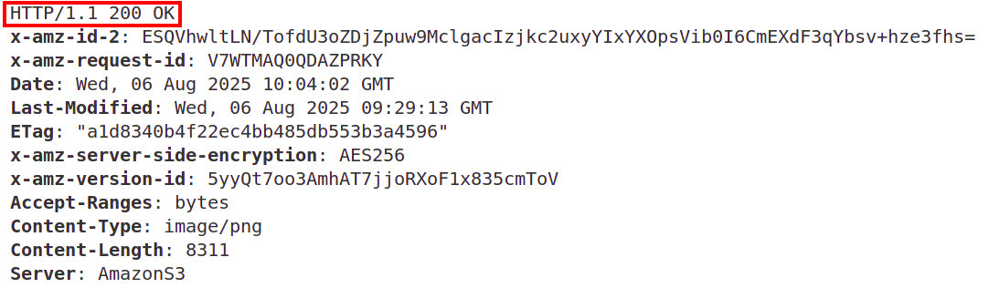

# amazon-eks-nodejs

This repo holds **express api sample** for [Amazon EKS Hands on Lab](https://catalog.us-east-1.prod.workshops.aws/workshops/9c0aa9ab-90a9-44a6-abe1-8dff360ae428/en-US)

## S3 Bucket

There is an issue with the original repository, where images are not loaded due to restricted access to the S3 bucket. For more information, see [No Images Loaded in the Frontend App](https://github.com/joozero/amazon-eks-frontend/issues/2) GitHub Issue.

To load your own images, first you have to provision your own S3 bucket and then upload the images.

To deploy S3 bucket:
```bash
cd terraform
terraform apply
```

To copy AWS Icon images:
```bash
aws s3 cp ./images/ s3://eks-workshop-img-bucket-<account_id>/ --recursive
```

or you can output the upload command via Terraform:
```bash
terraform output
```

## Replace Image URLs in `app.js` file

To make images available, you need to replace image URLs. To output the base image URL, run:
```bash
terraform output
```

To replace the URLs use `update-image-urls` script in `scripts` folder. Before running the script, change the `newBaseUrl` value to the output value from terraform.

To run the script:
```bash
node update-image-urls.js
```

To test if you can access the images (replace account ID with your value), run:
```bash
curl -I https://eks-workshop-img-bucket-339712714478.s3.us-east-1.amazonaws.com/demo-image-0.png
```

You should get `200 OK` response:



## Docker Image Optimization

The original image used in the workshop was extremely large (up to 1GB), requiring significant time to build and upload it to the registry. Therefore Dockerfile was updated and optmizied according to the best practices. 

As a reminder, the general **Docker optmization best practices** include:
- Use of slimmer images in size like [nodejs:alpine](https://hub.docker.com/_/node/tags) for a base image
- Use of multi-stage builds
- Optimize the use of `RUN` directive by combining them into one line via `&&` operator. Each `RUN` directive adds a new layer on top of the existing
- Avoid using `root`user and create dedicated, unprivileged user and group to run the application
- Use `.dockerignore` file to prevent unnecessary files from being copied into your image

To test the image locally, first build the image
```bash
docker build -t demo-nodejs-backend .
```

Run the container:
```bash
docker run -p 3000:3000 --name test-nodejs-backend demo-nodejs-backend
```

Open in the browser http://localhost:3000/ link or:
```bash
curl -I http://localhost:3000/services/all
```

you should see `200 OK` response.

### Pusing Image to the DockerHub

1. Create DockerHub repository and login via:
```bash
docker login
```
2. Tag the image:
```bash
docker tag demo-nodejs-backend:latest <your_dockerhub_username>/demo-nodejs-backend:latest
```
3. Push the image:
```bash
docker push <your_dockerhub_username>/demo-nodejs-backend:latest
```

Example Docker Image is available at: [makbanov/demo-nodejs-backend](https://hub.docker.com/r/makbanov/demo-nodejs-backend)